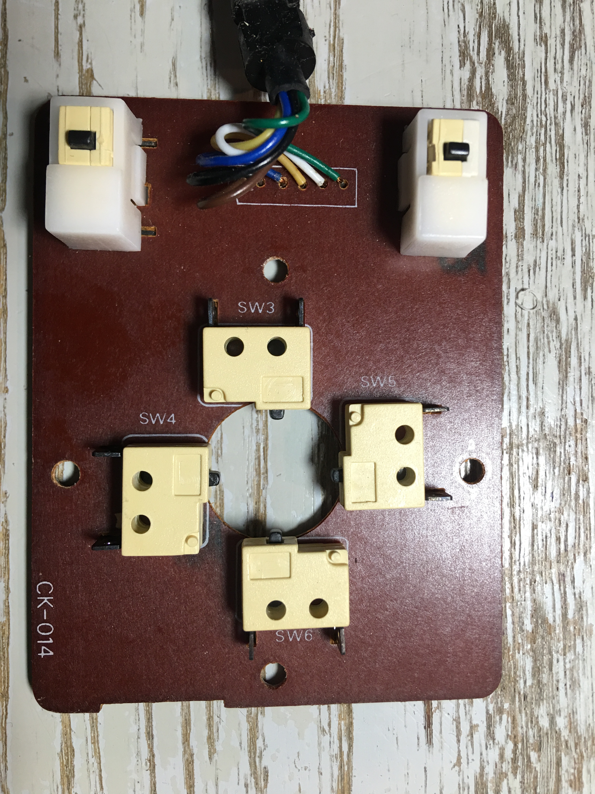
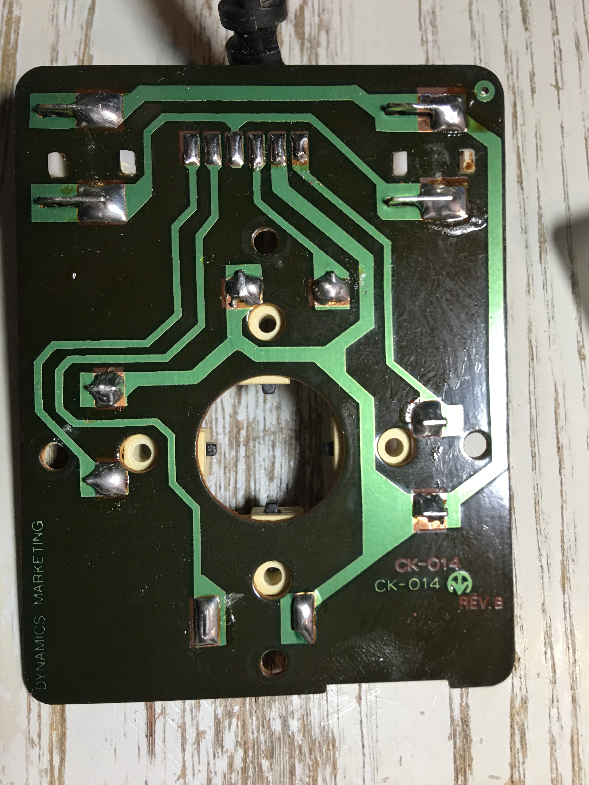
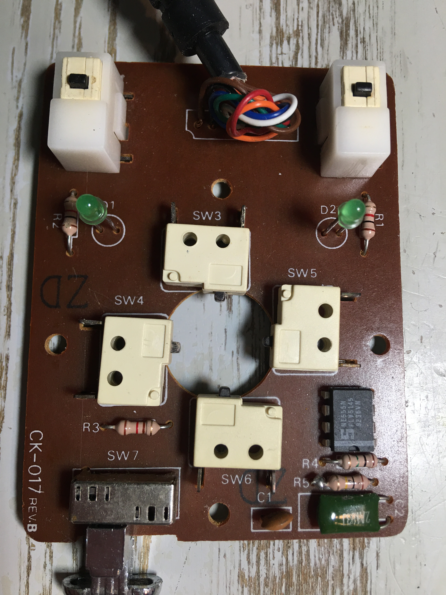
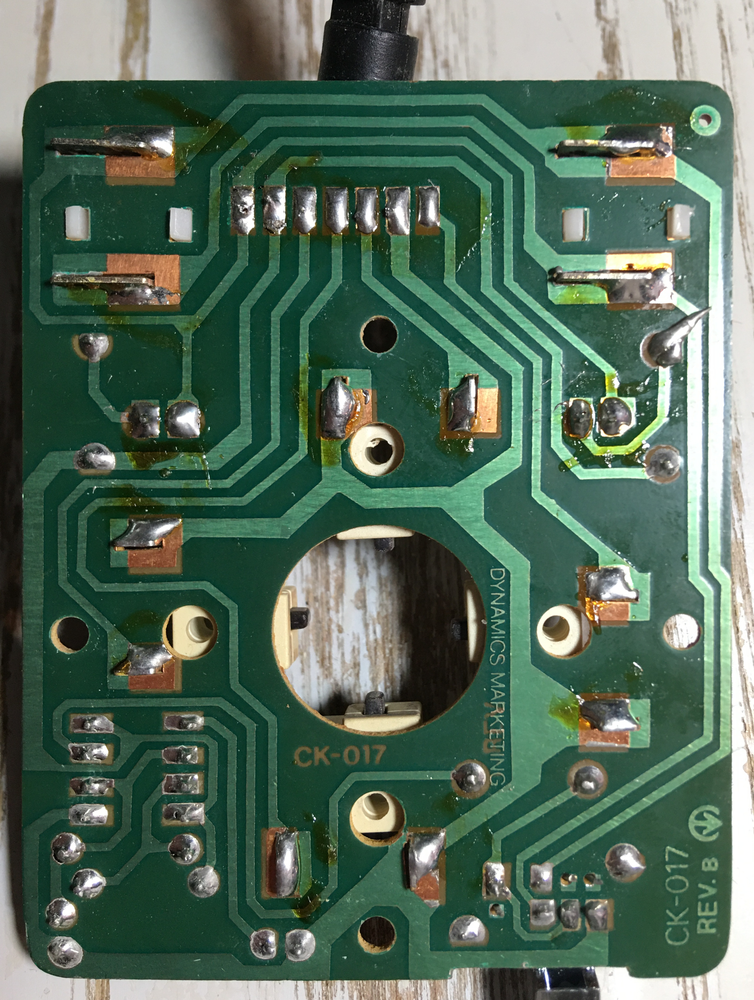
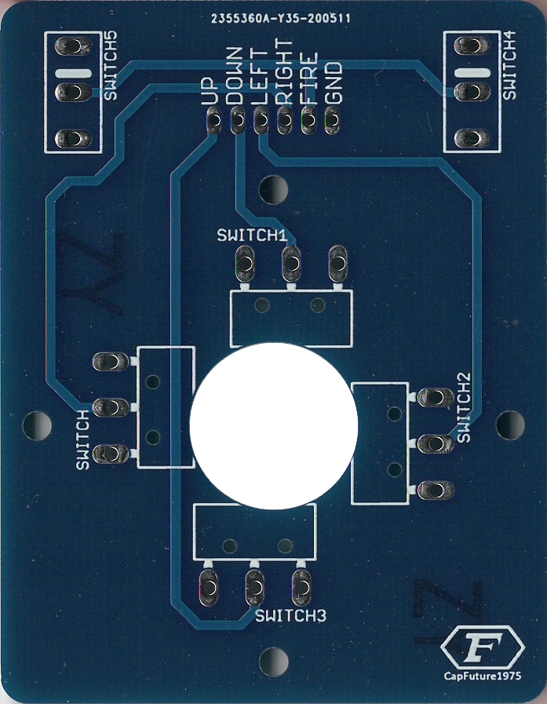
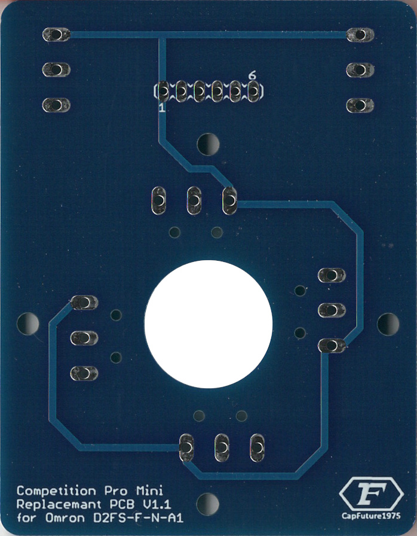
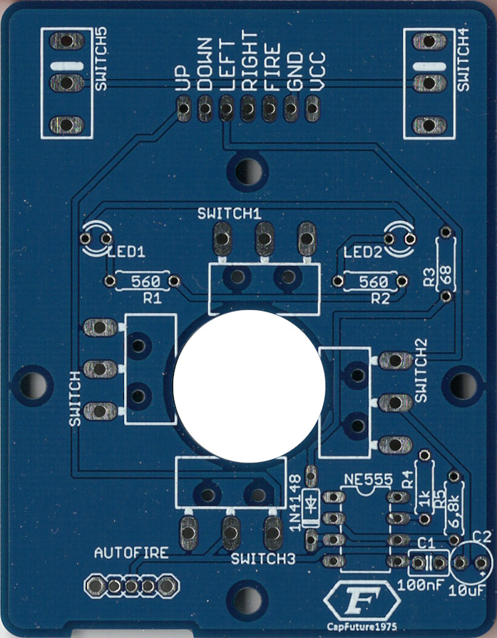
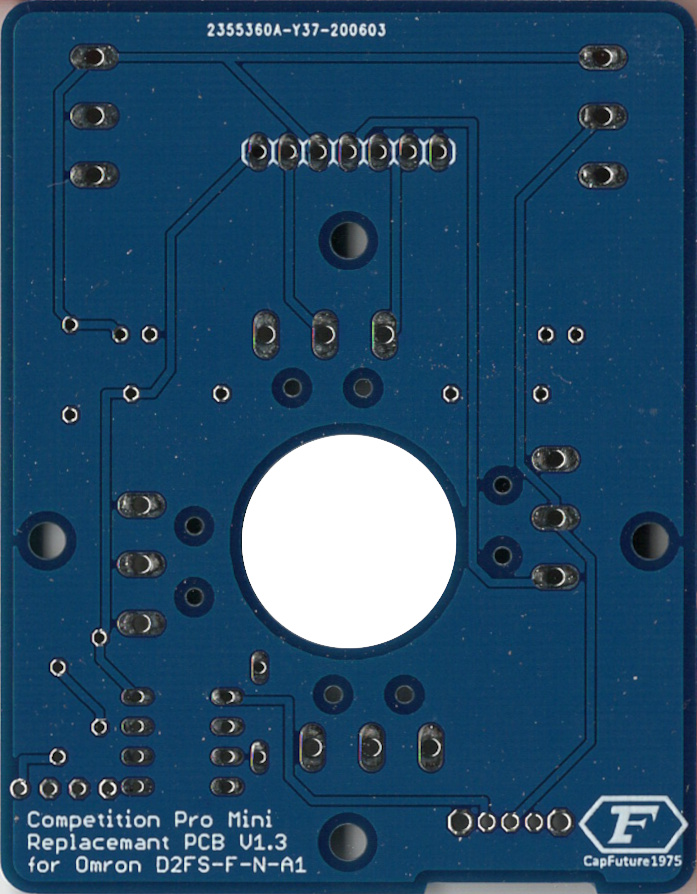

# Table of contents
<!-- TOC -->

- [Table of contents](#table-of-contents)
  - [Competition Pro Mini PCB replacement](#competition-pro-mini-pcb-replacement)
    - [Current state](#current-state)
    - [PCB pictures](#pcb-pictures)
      - [CK-014 Rev B (Dynamics Marketing)](#ck-014-rev-b-dynamics-marketing)
      - [CK-017 Rev B with autofire (Dynamics Marketing)](#ck-017-rev-b-with-autofire-dynamics-marketing)
      - [DIY © by CapFuture1975 v1.1](#diy--by-capfuture1975-v11)
      - [DIY © by CapFuture1975 v1.1 with autofire](#diy--by-capfuture1975-v11-with-autofire)

<!-- /TOC -->

## Competition Pro Mini PCB replacement

### Current state

> ⚠️ Current start repository. Work in progess. Just a collection repo at the moment. The respective creators own the copyright!

### PCB pictures

#### CK-014 Rev B (Dynamics Marketing)

| Top                                           | Bottom                                        |
| :-------------------------------------------- | :-------------------------------------------- |
|  |  |

#### CK-017 Rev B with autofire (Dynamics Marketing)

| Top                                           | Bottom                                        |
| :-------------------------------------------- | :-------------------------------------------- |
|  |  |

#### DIY © by CapFuture1975 v1.1

Links:
* https://www.forum64.de/index.php?thread/27322-competition-pro-mini-reparieren
* https://www.youtube.com/watch?v=5R7JxHTaWB4
* https://www.youtube.com/watch?v=qA27yQcbWV8

| Top                                           | Bottom                                        |
| :-------------------------------------------- | :-------------------------------------------- |
|  |  |

#### DIY © by CapFuture1975 v1.1 with autofire

| Top                                           | Bottom                                        |
| :-------------------------------------------- | :-------------------------------------------- |
|  |  |
