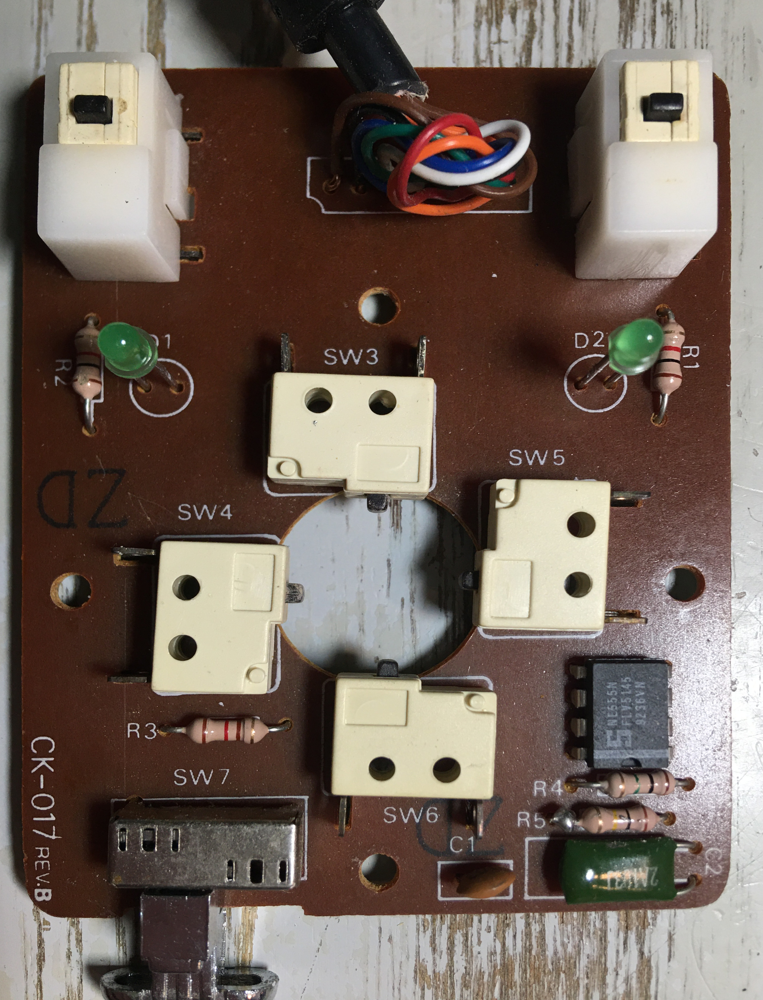

# Table of contents
<!-- TOC -->

- [Table of contents](#table-of-contents)
  - [Competition Pro Mini PCB replacement](#competition-pro-mini-pcb-replacement)
    - [Current state](#current-state)
    - [PCB pictures](#pcb-pictures)
      - [CK-014 Rev B (Dynamics Marketing)](#ck-014-rev-b-dynamics-marketing)
      - [CK-017 Rev B (Dynamics Marketing)](#ck-017-rev-b-dynamics-marketing)
      - [DIY © by CapFuture1975 v1.1](#diy--by-capfuture1975-v11)

<!-- /TOC -->

## Competition Pro Mini PCB replacement

### Current state

> ⚠️ Current start repository. Work in progess. There is more to come if free spare time is available 😉 e.g. adding KiCad files, BOM,.

### PCB pictures

#### CK-014 Rev B (Dynamics Marketing)

| Top                                           | Bottom                                        |
| :-------------------------------------------- | :-------------------------------------------- |
|  |  |

#### CK-017 Rev B (Dynamics Marketing)

| Top                                           | Bottom                                        |
| :-------------------------------------------- | :-------------------------------------------- |
|  |  |

#### DIY © by CapFuture1975 v1.1

| Top                                           | Bottom                                        |
| :-------------------------------------------- | :-------------------------------------------- |
|  |  |
